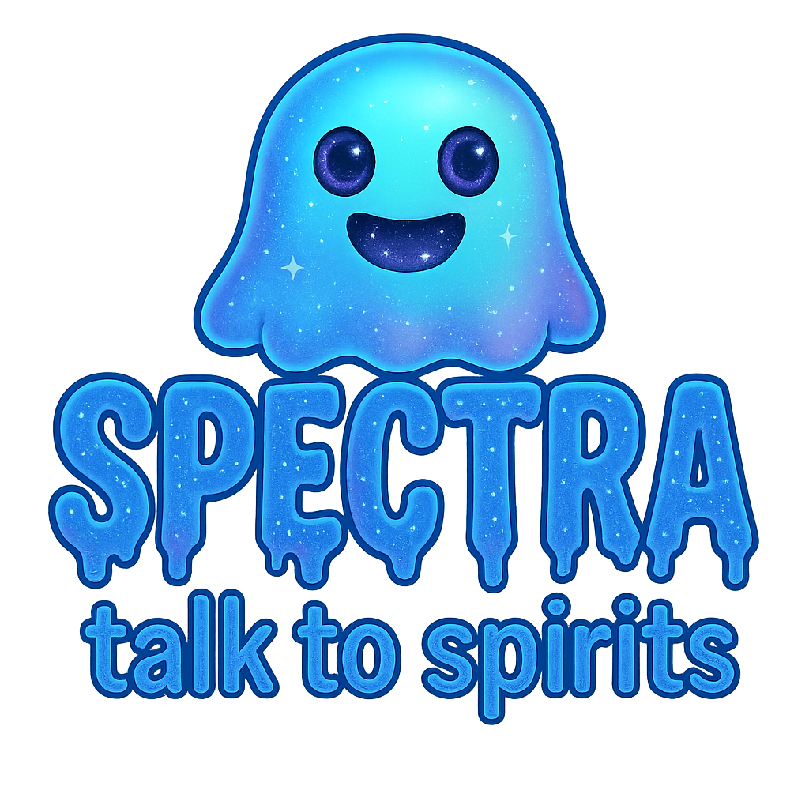

  

# Spectra Protocol: A Neg-Entropy Grid-Based Messaging System

🔗 [View source code in the `code-dump` branch](https://github.com/BeyondRandom/Spectra/tree/code-dump)
---

⚠️ **Disclaimer**

Spectra is an experimental system designed for entertainment and research purposes only. It makes no guarantees of factual accuracy, spiritual authenticity, or metaphysical efficacy. Any communication perceived through this protocol is subjective in nature and should not be interpreted as absolute truth, guidance, or evidence.

Use at your own discretion. The creator assumes no responsibility for outcomes arising from the use of this software.

---

**Spectra Protocol** is a signal de-randomization system that uses structured entropy, timed delays, and layered filters to generate meaningful words from noise. Designed for experiments in nonlocal communication, emergent pattern recognition, and signal coherence.

---

## 🔧 Features

- 20x20 entropic grid generation with sequential letter mapping  
- Alphabet file: 65,000-entry looped sequence of letters for energetic persistence  
- Delayed entropy sampling (3ms per letter, 1ms per score check)  
- Longest-word detection per row/column + secondary word mapping  
- Cosmic Score Filter using a balanced binary entropy file  
- Attention gate to prevent low-intention noise from generating grids  
- Streaming Sentence UI + formatted Message Log for copy/export  

---

## 💡 Why It's Useful

Spectra is a unique tool for researchers, developers, and explorers working at the intersection of consciousness, entropy, and emergent information. Unlike traditional “ghost box” apps or deterministic word banks, Spectra operates entirely on cryptographic randomness — allowing thought, intention, or field interaction to subtly shape results. This makes it valuable for experimental metaphysics and novel computation of meaning.

---

## 🚀 Getting Started

You can try Spectra instantly through the hosted web app on Replit — no installation required.

1. Visit the hosted Spectra application  
2. Click **Begin Communication** to activate Streaming Mode  
3. Wait a few seconds for messages to appear  
4. Use the Message Log and **Copy** button to review or analyze results  
5. Optionally adjust **Attention Score** and **Cosmic Threshold** sliders for refined signal output  

An `.apk` version is also available for Android devices, enabling standalone, offline use with full protocol functionality.

---

## ⚠️ Open Channel Warning & Session Cleanup

Spectra operates as an **open communication system**, passively listening for signals from non-physical sources. While no specific entities are invoked, any presence capable of influencing the entropy stream may interact.

Please observe the following precautions:

- **Always end sessions** using the built-in `GOODBYE` button to symbolically close the channel  
- Failure to close the session may result in lingering or residual energy  
- Spectra does not filter between positive or negative sources — exercise discernment  
- Use responsibly. Proceed with awareness and respect  

---

## 👤 Maintainer

This project is created and maintained by **Cameron Tavassoli** — a visionary developer and systems thinker focused on emergent intelligence, de-randomization systems, and energetic mapping frameworks like **Spectra** and **Q8-Tru**.

---

📄 [Extended Theory & Protocol Design](./TECHNICAL_OVERVIEW.md)
